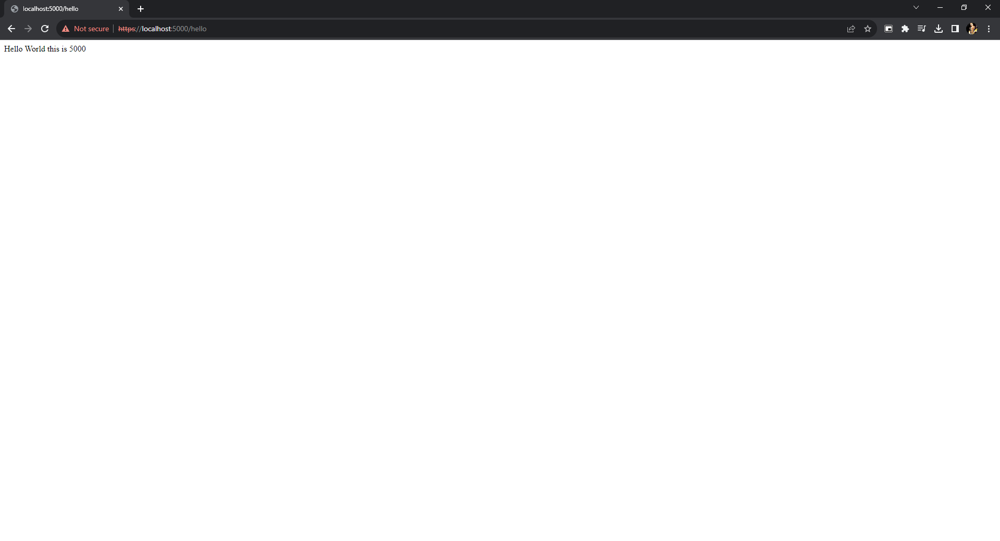
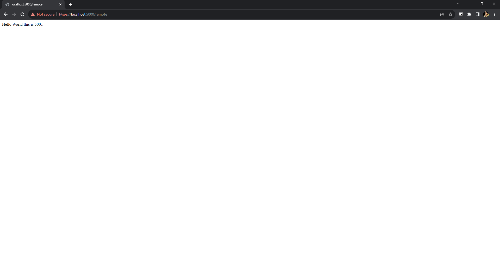
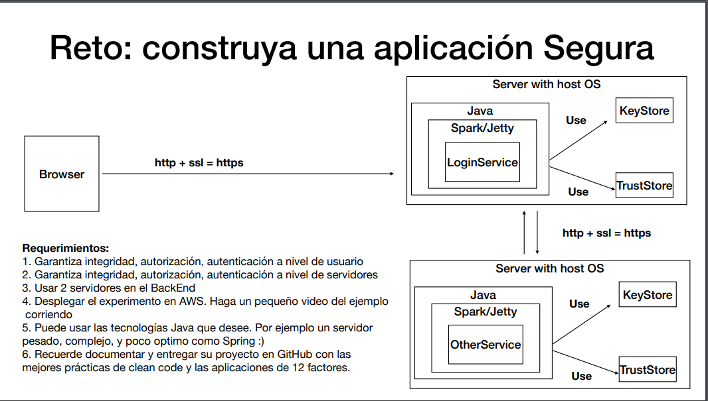

# Aplicación distribuida segura en todos sus frentes

En este repositorio se encuentra una aplicacion web segura los cuales garantizar autenticación, autorización e integridad de usuarios. tambien vamos probar la conexion entre dos computadores en la nube y la comunicación entre dos servicios web.
## Para empezar

Descargue y copie el repositorio en su maquina local.

### Prerrequisitos

- Java
- Maven

### Ejecución

Ubiquese en la carpeta llamada AppSecure y ejecute el comando:


```
mvn clean install
```

Luego de eso ejecute los comandos:

```
java -cp "target/classes;target/dependency/*" edu.escuelaing.arep.app.HelloWorld1
java -cp "target/classes;target/dependency/*" edu.escuelaing.arep.app.HelloWorld
```


Funcionamiento servidor 5000
<br>




Funcionamiento servidor 5001
<br>


<br>


Funcionamiento servidor 1 llamando al servidor dos
```
https://localhost:5000/remote
```


Funcionamiento servidor 2 llamando al servidor uno
```
https://localhost:5001/remote
```



## AWS


## ARQUITECTURA




## Video Funcionamiento AWS
    
- [Video]()

# Built With

- [Maven](https://maven.apache.org/) - Gestión de dependencias
- [JAVA](https://rometools.github.io/rome/) - Lenguaje de programación utilizado

## Authors

- **Juan Sebastian Rodriguez Peña** - [JSebastianRod](https://github.com/JSebastianRod)
